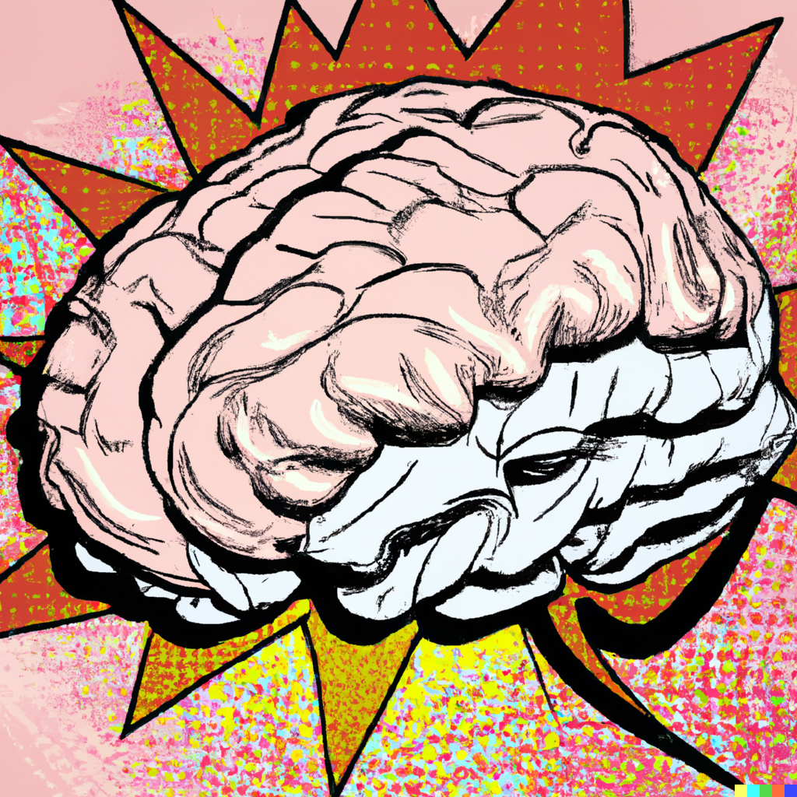
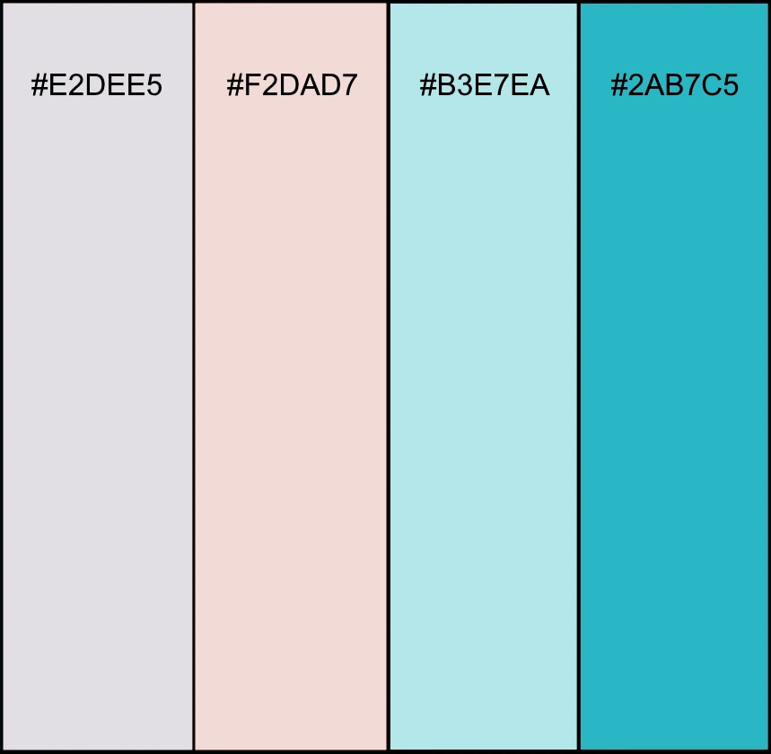
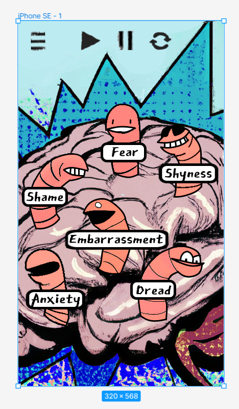
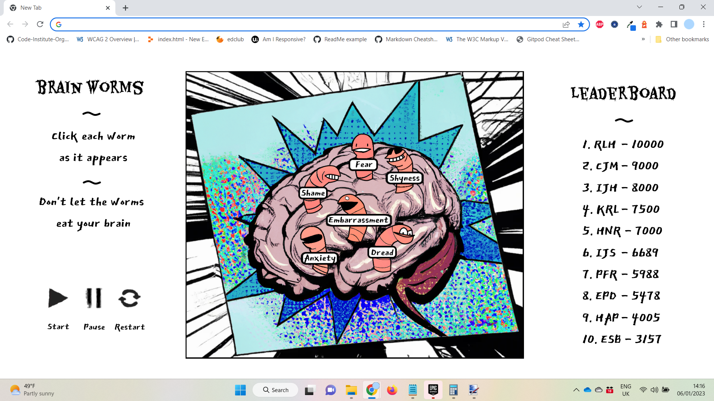

# Brain Worms

This website has been created to offer a Whack-A-Mole style game, where the moles are worms, are they ae inhabiting a brain. It has been designed with a range of different screen sizes in mind. 


[View the live project here](https://lithill.github.io/Brain-Worms/)

## Table of Contents

1. [User Experience](#user-experience)
3. [Design](#design)
4. [Wireframes](#wireframes)
5. [Features](#features)
6. [Accessibility](#accessibility)
7. [Technologies Used](#technologies-used)
8. [Deployment and Local Development](#deployment-and-local-development)
9. [Testing](#testing)
10. [Credits](#credits)
    
## User Experience

### Initial Discussion

There has been a rise in games aimed at improving mental health in recent years. For instance, the [Happify](https://www.happify.com/) app includes a game called Negative Knockout, which lets the user pick negative words they associate with how they are feeling, and proceed to eliminate them in an Angry-Birds-esque game. These games are typically cutesy in style. Brain Worms aims to be a fun version of this type of game for users with a darker sense of humour.

#### Key information for the site

* How to play the game.
* The game itself.

### User Stories

#### Client Goals

* To be able to view the site on a range of device sizes.
* To have fun whilst feeling more in control of negative feelings.

#### First Time Visitor Goals

* To find out how to play the game.
* To be able to play the game on different devices. 

#### Returning Visitor Goals (Stretch Goal)

* To see when I beat my own score.
* To get trophies based on the worms that have been most consistently hit. (I.e. If you always hit fear you get the courage trophy.)

#### Frequent Visitor Goals (Stretch Goal)

* To see the collection of trophies you have won since your first visit.
* To have my score displayed on a leaderboard if I reach the top 10.

## Design

### Early Design Phases

The design was created mobile-first. The first version of the design featured realistic images of a brain and a worm, created by Dall-E 2 and spliced together. It demonstrated that a realistic approach was unsuitable. 

[Early design featuring a realistic brain with a worm emerging from it](assets/images/readme/realistic-brain.JPG)

It was the felt that a pop art style would be more suitable. The phrase “comic book of a side-shot of a human brain" was used to create the following image in Dall-E 2.



The rest of the designs started out as the following:

* [“black and white comic book panel frame”](assets/images/readme/frame.png)
* [“comic book panel earthworm with white background” 1](assets/images/readme/worm1.png)
* [variation from first worm - 2](assets/images/readme/worm2.png)
* [variation from first worm - 3](assets/images/readme/worm3.png)
* [variation from first worm - 4](assets/images/readme/worm4.png)
* [variation from first worm - 5](assets/images/readme/worm5.png)
* [variation from first worm - 6](assets/images/readme/worm6.png)

### Colour scheme

The website uses a palette of colours that lends itself to pop-art. This style was chosen in order to contrast the creepiness of brain-eating worms. 



### Typography

Google Fonts was used for the following fonts:

* Eater is a serif font. This is used for the headings.
* East Sea Dokdo is a sans-serif font. This is used for paragraph text.

### Media

* [Dall-E 2](https://openai.com/dall-e-2/) was used to create all of the artwork.

### Features

The website is comprised of 1 page. This page has the following features:

* Instructions on how to play the game.
* Buttons that start, pause and restart the game.
* Brain Worms whack-a-mole style game.
* Leaderboard.

### Accessibility

I have been mindful during coding to ensure that the website is as accessible as possible. I have achieved this by:

* Using semantic HTML.
* Using descriptive alt attributes on images on the site.
* Providing information for screen readers where there are icons used and no text, such as footer icons.
* Guaranteeing adequate colour contrast throughout the site.
  
## Wireframes

The Wireframes were made via [Paint.net](https://www.getpaint.net/). This is a mobile-first build. 

#### Mobile Wireframe



#### Desktop Wireframe




## Technologies Used

### Languages Used

HTML5, CSS3 and JavaScript were used to create this website.

### Frameworks, Libraries & Programs Used

* [Google Fonts](https://fonts.google.com/) was used to import East Sea Dokdo and Eater.
* [Git](https://git-scm.com/) was used for version control by using the Gitpod terminal to commit to Git and Push to GitHub.
* [GitHub](https://github.com/) was used to store the projects' code after being pushed from Replit, and to handle version control.
* [Dall-E 2](https://openai.com/dall-e-2/) was used to generate images to use for the game.
* [Paint.Net](https://www.getpaint.net/download.html) was used to edit the Dall-E 2 images.
* [Google Dev Tools](https://developer.chrome.com/docs/devtools/) was used to troubleshoot and test features and solve issues with responsiveness and styling.
* [Am I Responsive?](https://ui.dev/amiresponsive) was used to show the website on a range of devices.
* [Balsamiq](https://balsamiq.com/) was used to grab a screenshot of an iphone SE wireframe template.
* [Readme.so](https://readme.so/editor) was used to create the early version of the readme.
* [Unicorn Revealer](https://chrome.google.com/webstore/detail/unicorn-revealer/lmlkphhdlngaicolpmaakfmhplagoaln?hl=en-GB) was used for debugging.
* [Real Favicon Generator](https://realfavicongenerator.net/) was used to create a favicon and generate the code needed to insert it.
* [Layoutit!](https://grid.layoutit.com/) was used to create the css grid.


## Deployment & Local Development

### Deployment

This project was deployed to GitHub Pages using the following steps:

1. Log into GitHub and locate the [GitHub Repository](https://github.com/Lithill/Brain-Worms).
2. Click the settings button (above the "add file" button).
3. Click on "Pages" on the left-hand-side column.
4. Under "Source", click the dropdown called "Main", select folder ""/root" and click "save".
5. Refresh the page.
6. Click on the "Visit site" button at the top of the page.

### Local Deployment

#### How to Fork

To fork the Brain Worms repository:

1) Log in (or sign up) to GitHub.
2) Go to the repository for this project, at [GitHub Repository](https://github.com/Lithill/Brain-Worms).
3) Click the Fork button in the top right corner.

#### How to Clone

To clone the Brain Worms repository:

1) Log in (or sign up) to GitHub.
2) Go to the repository for this project, at [GitHub Repository](https://github.com/Lithill/Brain-Worms).
3) Above the list of files, click "Code".
4) Click "Open with GitHub Desktop" to clone and open the repository with GitHub Desktop.
5) Click "Choose..." and, using Windows Explorer, navigate to a local path where you want to clone the repository.
6) Click "Clone".
   
## Testing

### W3C Validator

### Solved Bugs

1.
	1. Expected behaviour: Initial alert box does not accept any input that isn't a letter
   2. Actual bevahiour: Initial alert box accepts ### as a value
   3. Solution: Build in a function that checks for letters only

2.
	1. Expected behaviour: Worm animations always smooth 
   2. Actual bevahiour: Sometimes animations stop halfway through the animation and disapear

```JavaScript
   function pickWorm () {

      const wormArr = ["empty", "fear", "shame", "shyness", "embarrassment", "anxiety", "dread"];

      function animateWormFunction () {  
    
        setInterval(function () {
            let randomWormNumber = generateRandomNum(1, 6); //generates number between 1-6
            let activeWorm = wormArr[randomWormNumber]; //assigns this number to wormArr index
            let activeWormString = "." + activeWorm; //creates class name for worm that has been picked

            //assigns .slide class to the picked worm
            let worm = document.querySelector(activeWormString);//assigning picked worm class

            worm.classList.toggle("slide"); //do I need to toggle this off afterwards?

        }, 1000);
    }
```

   3. Solution: Stop the function from animating the same worm twice in a row

3.
	1. Expected behaviour: Worm animations are always visible when requested by the code
   2. Actual bevahiour: Sometimes some picked worm animations are skipped, even though they are not repeats of the previous picked worm
   3. Solution: Are there worm gaps because it's taking away the class that it previously gave? Or trying to apply a class to one that already has the class, and therefore toggles it off?

### Known Bugs

* Layout has unintended horizontal and verticle scrollbars on desktop view 

### Lighthouse

### Full Testing

#### Links:

## Credits

### Code Used

* [Layoutit!](https://grid.layoutit.com/) was used to create custom css code for the grid.
* [adhithyan15's countdown.js](https://gist.github.com/adhithyan15/4350689) was used to create game countdown.
* [Nikhil Aggarwal's for-loop on Stack Overflow](https://stackoverflow.com/questions/32027935/addeventlistener-is-not-a-function-why-does-this-error-occur) was used to iterate through the worm class for the click event listner.

### Content

Content for the website was written by Rossanne Hamilton.

### Media

* [Dall-E 2](https://openai.com/dall-e-2/) was used to create all of the artwork, which was then edited by Rossanne Hamilton to create the final graphics.
* Rossanne Hamilton created the menu, play, pause and restart icons. 

### Acknowledgements

I would like to acknowledge the following people who helped me along the way in completing my second milestone project:

- Rimi Hussain for her idea to call it Brain Worms (before the idea included a brain or worms in the design), and to create trophies based on the worms you most consistently hit.
- My tutor Robert Mclaughlin for helpful feedback and sharing links for further learning.
- My mentor Mitko Bachvarov for helpful feedback and sharing links for further learning.

