# Brain Worms

This website has been created to offer a Whack-A-Mole style game, where the moles are worms, are they ae inhabiting a brain. It has been designed with a range of different screen sizes in mind. 

[View the live project here](https://lithill.github.io/Brain-Worms/)

## Table of Contents

1. [User Experience](#user-experience)
3. [Design](#design)
5. [Features](#features)
6. [Accessibility](#accessibility)
7. [Technologies Used](#technologies-used)
8. [Deployment and Local Development](#deployment-and-local-development)
9. [Testing](#testing)
10. [Credits](#credits)
    
## User Experience

### Initial Discussion

In recent years there has been a rise in games aimed at improving mental health. For example, the [Happify](https://www.happify.com/) app includes a game called Negative Knockout, which lets the user pick negative words they associate with how they are feeling, and proceed to eliminate them in an Angry-Birds-esque game. These games are typically cutesy in style. Brain Worms aims to be a fun version of this type of game for users with a darker sense of humour.

#### Key information for the site

* How to play the game.
* The game itself.
* Top ten scores (leaderboard).

### User Stories

#### Client Goals

* To be able to view the site on a range of device sizes.
* To have fun whilst feeling more in control of negative feelings.

#### First Time Visitor Goals

* To find out how to play the game.
* To be able to play the game on different devices. 

#### Returning Visitor Goals 

* To have my score displayed on a leaderboard if I reach the top 10.

## Design

### Early Design Phases

The design was created mobile-first. The first version of the design featured realistic images of a brain and a worm, created by Dall-E 2 and spliced together. It demonstrated that a realistic approach was unsuitable. 

[Early design featuring a realistic brain with a worm emerging from it](assets/images/readme/realistic-brain.JPG)

It was then felt that a pop art style would be more suitable. The phrase “comic book of a side-shot of a human brain" was used to create the following image in Dall-E 2.

The rest of the designs started out as the following:

* [“black and white comic book panel frame”](assets/images/readme/frame.png)
* [“comic book panel earthworm with white background” 1](assets/images/readme/worm1.png)
* [variation from first worm - 2](assets/images/readme/worm2.png)
* [variation from first worm - 3](assets/images/readme/worm3.png)
* [variation from first worm - 4](assets/images/readme/worm4.png)
* [variation from first worm - 5](assets/images/readme/worm5.png)
* [variation from first worm - 6](assets/images/readme/worm6.png)

### Colour scheme

The website uses a palette of pastel colours that also lends themselves to pop-art. This was chosen as a counterweight to the creepiness of the theme. 

### Typography

Google Fonts was used for the following fonts:

* Eater is a serif font. This is used for the headings.
* East Sea Dokdo is a sans-serif font. This is used for all other text.

### Media

* [Dall-E 2](https://openai.com/dall-e-2/) was used to create the basis of all of the artwork. Most of the artwork was then edited further by the developer. 

### Wireframes

The Wireframes were made via [Paint.net](https://www.getpaint.net/). This is a mobile-first build. 

#### Mobile Wireframe

Early version

Later version

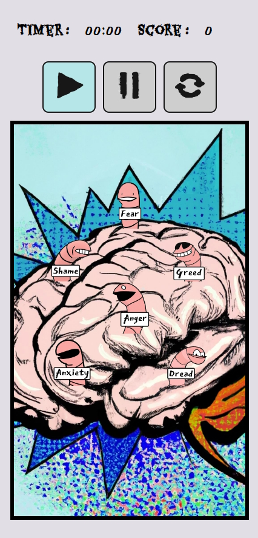

#### Desktop Wireframe

Early version

 

Later version

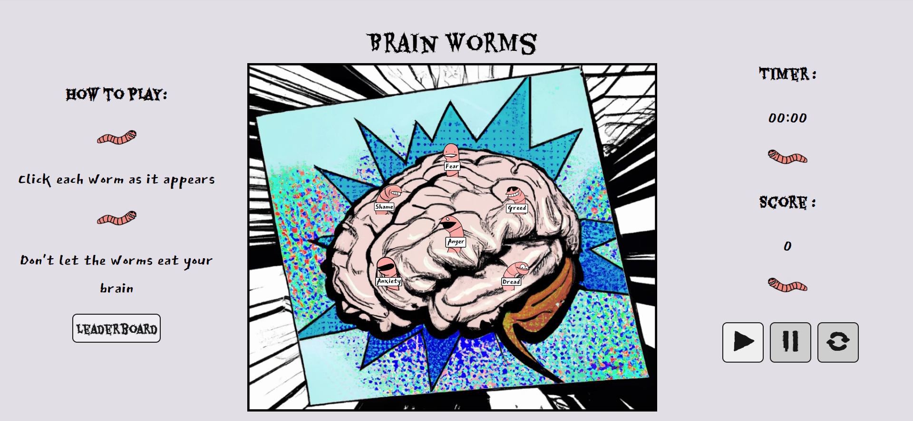 

## Features

The website is comprised of one page. This page has the following features:

* Game buttons:
   * Play button, which starts the game. Buttons is greyed out whilst overlays are visible, or game is playing.

   

   * Pause button, which pauses the game. Button is greyed out whilst game isn't playing.

   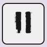

   * Restart button, which restarts the game. Button is greyed out whilst game isn't playing.

   

   * Leaderboard button, which displays the leaderboard overlay. Button is greyed out whilst game is playing and overlays are visible.

   

* Several overlays containing extra information:

   * How to play the game. Appears on page load in mobile and tablet views. Disapears when "Got It" button is pressed. 

   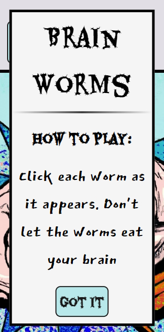

   * Asking for player name. Appears when play button is pressed. Changes inner html if an inappropriate name is given and player presses submit button. Disapears when submit button is pressed after appropriate name is given. 

   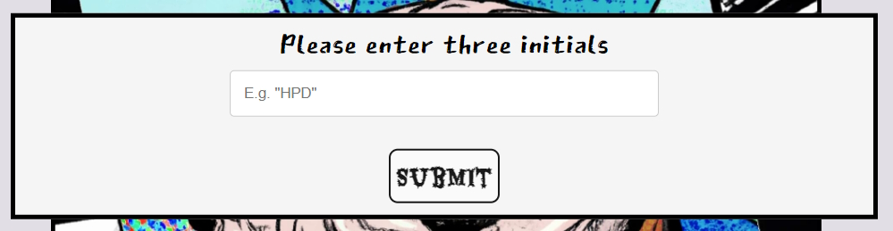
   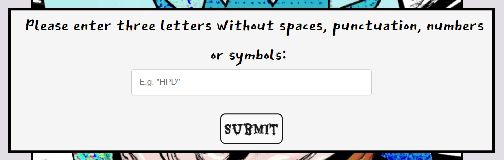

   * Player greeting. Appears when player offers an appropriate name. Includes the name offered by the player. Disapears when player presses "show me the worms" button.

   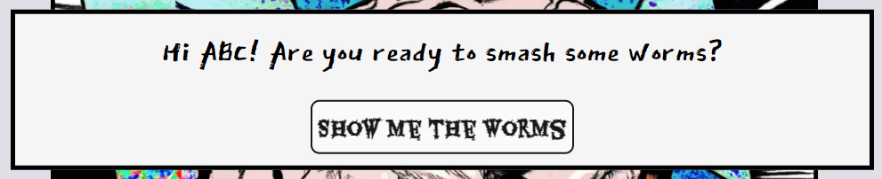

   * Pause game. Appears when player presses pause button during gameplay. Disapears when player presses ok button.

   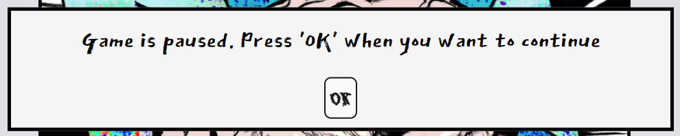

   * Restart game. Appears when player presses restart button during gameplay. Disapears when player presses ok button.

   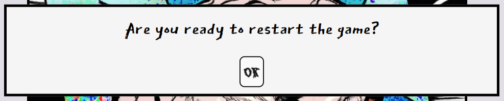

   * Game over. Appears when countdown timer reaches 0. Displays players score. Disapears when player presses ok button.

   

   * Local storage leaderboard. Displaying the top ten scores. Disapears when player presses the exit button.

   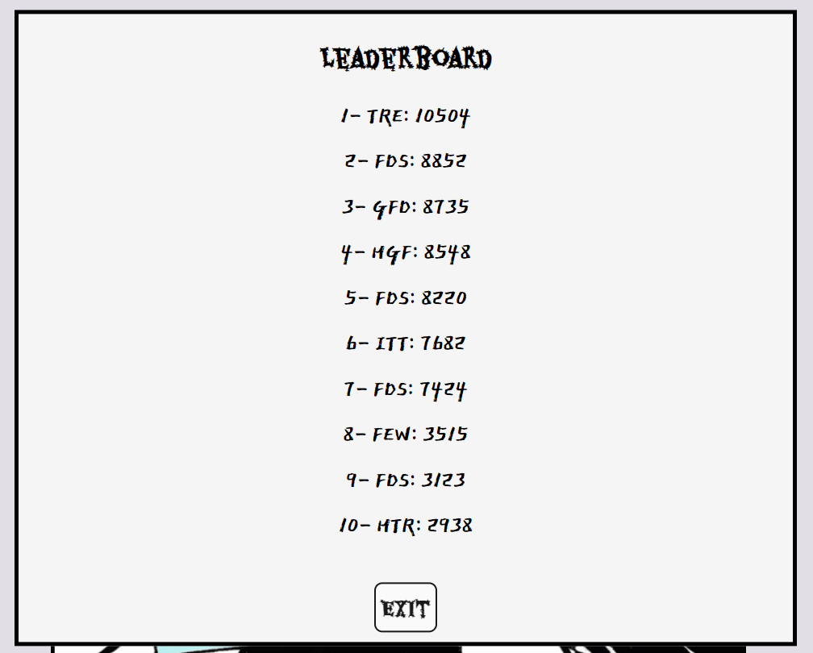

* Game timer. Counts down the time left until end of gameplay. 

   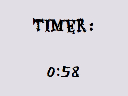

* Player score. Shows the player what score they currently have.

   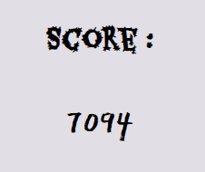

* Worm sprites. Worms for the player to click on in order to add to their score. 

   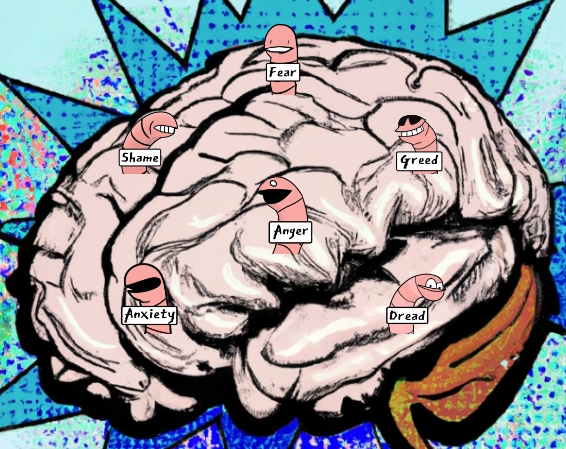

### Future Features

* For there to be a 'POW!' image that replaced each worm for a few seconds when clicked
* To include sound effects and background music that the user is able to turn on and off. 
* To see when I beat my own previous score.
* To have a leaderboard that doesn't just gather data locally.
* To get trophies based on the worms that have been most consistently hit. (Eg. If you always hit 'fear' you get the 'courage' trophy. If you hit them all you get the 'zen' trophy.)
* To see the collection of trophies you have won since your first visit.
* To enable the user to change the words on the worm labels.
* For the screen to get darker with each worm missed, and lighter with each worm hit. 

## Accessibility

I have been mindful during coding to ensure that the website is as accessible as possible. I have achieved this by:

* Using semantic HTML.
* Using descriptive alt attributes on images on the site.
* Providing information for screen readers where there are icons used and no text, such as footer icons.
* Guaranteeing adequate colour contrast throughout the site.

## Technologies Used

### Languages Used

HTML5, CSS3 and JavaScript were used to create this website.

### Frameworks, Libraries & Programs Used

* [Google Fonts](https://fonts.google.com/) was used to import East Sea Dokdo and Eater.
* [Git](https://git-scm.com/) was used for version control by using the Gitpod terminal to commit to Git and Push to GitHub.
* [GitHub](https://github.com/) was used to store the projects' code after being pushed from Replit, and to handle version control.
* [Dall-E 2](https://openai.com/dall-e-2/) was used to generate images to use for the game.
* [Paint.Net](https://www.getpaint.net/download.html) was used to edit the Dall-E 2 images.
* [Chrome Dev Tools](https://developer.chrome.com/docs/devtools/) was used to troubleshoot and test features and solve issues with responsiveness and styling.
* [Am I Responsive?](https://ui.dev/amiresponsive) was used to show the website on a range of devices.
* [Balsamiq](https://balsamiq.com/) was used to grab a screenshot of an iphone SE wireframe template.
* [Readme.so](https://readme.so/editor) was used to create the early version of the readme.
* [Unicorn Revealer](https://chrome.google.com/webstore/detail/unicorn-revealer/lmlkphhdlngaicolpmaakfmhplagoaln?hl=en-GB) was used for debugging.
* [Real Favicon Generator](https://realfavicongenerator.net/) was used to create a favicon and generate the code needed to insert it.
* [Layoutit!](https://grid.layoutit.com/) was used to create the css grid.

## Deployment & Local Development

### Deployment

This project was deployed to GitHub Pages using the following steps:

1. Log into GitHub and locate the [GitHub Repository](https://github.com/Lithill/Brain-Worms).
2. Click the settings button (above the "add file" button).
3. Click on "Pages" on the left-hand-side column.
4. Under "Source", click the dropdown called "Main", select folder ""/root" and click "save".
5. Refresh the page.
6. Click on the "Visit site" button at the top of the page.

### Local Deployment

#### How to Fork

To fork the Brain Worms repository:

1) Log in (or sign up) to GitHub.
2) Go to the repository for this project, at [GitHub Repository](https://github.com/Lithill/Brain-Worms).
3) Click the Fork button in the top right corner.

#### How to Clone

To clone the Brain Worms repository:

1) Log in (or sign up) to GitHub.
2) Go to the repository for this project, at [GitHub Repository](https://github.com/Lithill/Brain-Worms).
3) Above the list of files, click "Code".
4) Click "Open with GitHub Desktop" to clone and open the repository with GitHub Desktop.
5) Click "Choose..." and, using Windows Explorer, navigate to a local path where you want to clone the repository.
6) Click "Clone".
   
## Testing

esting was ongoing throughout the entire build. I utilised Chrome developer tools while building to pinpoint and troubleshoot any issues as I went along.

### W3C Validator

The [W3C HTML Validator](https://validator.w3.org/) was used to validate the HTML on all pages of the website. 

Results from the [check](assets/images/readme/html-checker.png).

### CSS Validator

The [W3C CSS Validator](https://jigsaw.w3.org/css-validator/) was used to validate the CSS in the style.css file.

Results from the [check](assets/images/readme/css-checker.png).

### JSLint Validator

The [JSLint Validator](https://www.jslint.com/) was used to validate the JavaScript in the script.js file.

Results from the [check](assets/images/readme/js-checker.png).

### Solved Bugs

1.
	1. Expected behaviour: Initial alert box does not accept any input that isn't a letter.
   2. Actual behaviour: Initial alert box accepts ### as a value.
   3. Solution: Build in a function that checks for letters only.

2.
	1. Expected behaviour: Worm animations are always smooth .
   2. Actual behaviour: Sometimes animations stop halfway through the animation and disapear.
   3. Solution: Stop the function from animating the same worm twice in a row.

3.
	1. Expected behaviour: Worm animations are always visible when requested by the code.
   2. Actual behaviour: Sometimes some picked worm animations are skipped, even though they are not repeats of the previous picked worm.
   3. Solution: There seemed to be gaps because instead of animating, it was toggling off .slide from worms it had previously been applied to. Applying toggle again at the end of the function prevented this. 

4.
	1. Expected behaviour: Worm animations don't have a gap between them.
   2. Actual behaviour: Sometimes there was a second gap with no worm animation.
   3. Solution: Take out the code that skipped animation if the same worm had been animated previously. Instead, insert if statement detailing what to do in this instance, and adding or subtracting from randomWormNumbr before running the animateWorm function. 

5.
	1. Expected behaviour: Players should earn the same amount of points when clicking on worms after restarting the game.
   2. Actual behaviour: Players earn extra points when restarting. After clicking restart once, points per click = 2. After clicking restart for a second time during the same session, points per click = 3. 
   3. Solution: I didn't notice when this got fixed, as I think it was linked to something else I fixed. I think the game run-code was duplicating itself rather than stopping and starting again, causing interesting bugs in the process. 

6.
	1. Expected behaviour: Worm animations are smooth and do not blink off.
   2. Actual behaviour: When speed of setInterval increases, some worm animations disapear without running through the whole animation.
   3. Solution: Add an if statement to see if the chosen worm is currently going through it's animation (e.g. if it has the "switch" class applied to it), and if it is, do not go to the animateWorm function for that setInterval round. 

7.
   1. Expected behaviour: When player finishes the game, and presses play again, the game works the same way it did the first time around.
   2. Actual behaviour: When player finishes the game, and presses play again, the timer is broken and reads "0:0-1", and there are too many animations triggered.
   3. Solution: Reset tickMinutes, tickSeconds and intervalNum before game is played again.

8.
	1. Expected behaviour: When pausing the game and navigating away from the page, everything should be paused when you come back to the page.
   2. Actual behaviour: When pausing the game and navigating away from the page, the worm animation continues and the timer starts counting down from where it was set. 
   3. Solution: Swap alert boxes for overlays.

9.
	1. Expected behaviour: On iPhone, user isn't given the option to stop the alert boxes popping up. 
   2. Actual behaviour: On iPhone, user is given the option to "supress dialogs", which can break the game.
   3. Solution: Swap alert boxes for overlays.

10.
    1. Expected behaviour: User can't gain more points by multiply clicks per animation.
    2. Actual behaviour: Users can get multiple points by clicking on the same animation.
    3. Solution: Insert click counter and if statement - only add point for the first click.

11.
    1. Expected behaviour: Player's "You scored x" number is the same across different parts of the page.
    2. Actual behaviour: Player's "You scored x" overlay number can be less than the actual score due to animation still being clickable after the overlay grabs the playerScore. 
    3. Solution: setTimeout on game-over overlay so that these don't overlap.

12.
    1. Expected behaviour: Leaderboard to appear and buttons to unfreeze after game ends.
    2. Actual behaviour: Leaderboard did not appear and buttons did not unfreeze after game ends. 
    3. Solution: Create if statement to check if leaderboardArr is null. 

13.
    1. Expected behaviour: When there are no high scores on the leaderboard, the overlay reads "You don't have any high scores yet!"
    2. Actual behaviour: The overlay does not include this sentance.
    3. Solution: Put if statement in leaderboardHTML function, so the phrase isn't overwritten with nothing if there is nothing in local storage. 

14.
    1. Expected behaviour: Buttons work as expected
    2. Actual behaviour: When restart button is pressed first, overlay shows "Game isn't playing" and then starts the game without player pressing play. Then the pause button doesn't work.
    3. Solution: Disable unnecessary buttons
   
### Known Bugs

No currently known bugs.

### Lighthouse

I used Lighthouse through Chrome Developer Tools to test accessibility, performance, best practices and SEO of the website.

#### Initial Testing

Unfortunately, I forgot to get the initial desktop test before starting to make improvements from the mobile test. 

[Mobile](assets/images/readme/mobile-lighthouse.png)

Improvements recommended:

* [user-scalable="no"] is used in the <meta name="viewport"> element or the [maximum-scale] attribute is less than 5.
* Serves images with low resolution.
* Does not include a title.

#### Fixes and Most Recent Lighthouse Testing

After fixing the recommended areas, this is the lighthouse tests that the webpage received:

[Desktop](assets/images/readme/desktop-lighthouse-after.png) ~ [Mobile](assets/images/readme/mobile-lighthouse-after.png)

### Full Testing

To fully test my website, I used Google Chrome Developer Tools to ensure that the page was responsive on all available screen sizes. Testing was performed on a variety of browsers (Chrome, Microsoft Edge and Firefox) and devices (Gigabyte gaming laptop, iPhone SE, Android one+ 9 mobile, Lenovo Legion Laptop, Huawei P Smart Phone, Fair Phone).

#### Buttons:

Tested each button on the page. Each button worked as expected, or was appropriately disabled. All buttons were clicked during a variety of game-play-states, and in a variety of orders. 

#### Player Name Form:

Tested the player name form with a variety of inputs, to ensure appropriate playername has been chosen. User is prompted with additional hints about the player name if they have failed to choose one that the form will accept.

#### Worms:

Tested clickability of worms and other spaces on the page. Worms only award points once per click during each animation. Non-animated sections of the page do not award clicks when clicked on.

#### Leaderboard:

Tested that leaderboard displays message of encouragement when there are no high scores on the users device. Checked that leaderboard does not go above having ten scores on there, that the scores are ordered from high to low, and that they are updated with each completion of the game, so long as the user has an appropriately high score.

## Credits

Thanks are given for the following blogs and tutorials:

* [CodeBrainer's](https://www.codebrainer.com/blog/contact-form-in-javascript) tutorial on building working forms.
* [Catalin Pit's](https://catalins.tech/store-array-in-localstorage/) tutorial on local storage.
* [W3School's](https://catalins.tech/store-array-in-localstorage/) tutorial on responsive forms.

### Code Used

* [Layoutit!](https://grid.layoutit.com/) was used to create custom css code for the grid.
* [adhithyan15's countdown.js](https://gist.github.com/adhithyan15/4350689) was used to create the countdown timer.
* [Nikhil Aggarwal's for-loop on Stack Overflow](https://stackoverflow.com/questions/32027935/addeventlistener-is-not-a-function-why-does-this-error-occur) was used to iterate through the worm class for the click event listner.
* [gen_Eric's code on Stack Overflow](https://stackoverflow.com/questions/17684921/sort-json-object-in-javascript) was used to return highest to lowest scores from leaderboardArr.
* [CSS Tricks - simple styles for 
's](https://css-tricks.com/examples/hrs/) was used to create custom line.
* [pstanton's code on Stack Overflow](https://stackoverflow.com/questions/7693224/how-do-i-right-align-div-elements) was used to right-aline a div element.

### Content

Content for the website was made by Rossanne Hamilton.

### Media

* [Dall-E 2](https://openai.com/dall-e-2/) was used to create all of the artwork, which was then edited by Rossanne Hamilton to create the final graphics.
* Rossanne Hamilton created the menu, play, pause and restart icons. 

### Acknowledgements

I would like to acknowledge the following people who helped me along the way in completing my second milestone project:

- My mentor Mitko Bachvarov for helpful feedback and sharing links for further learning.
- Rimi Hussain for her idea to call it Brain Worms (before the idea included a brain or worms in the design).
- Chris Mugridge for suggesting I insert an if-statement detailing what to do when randomWormNumber is the same as lastWorm, and adding or subtracting from randomWormNumbr before running the animateWorm function. (Instead of skipping the animateWorm function and trying to change the setInterval time for that specific loop around setInterval.)
- My tutor Robert Mclaughlin for helpful feedback and sharing links for further learning.